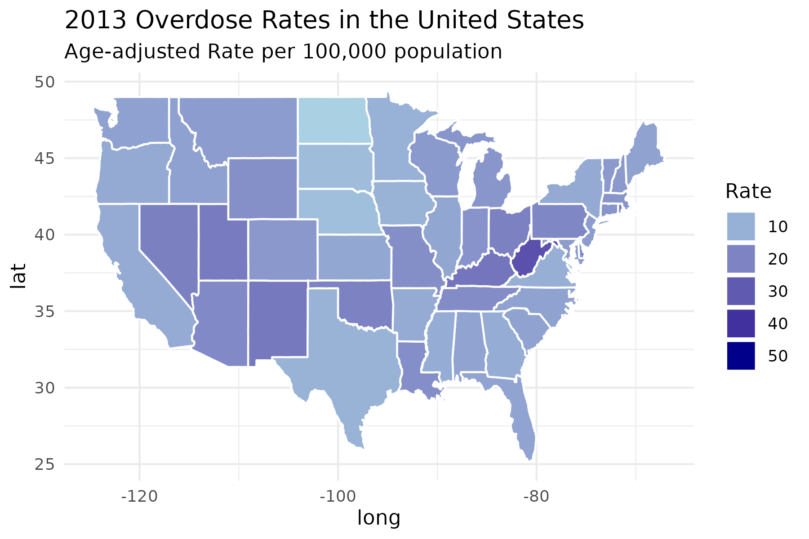
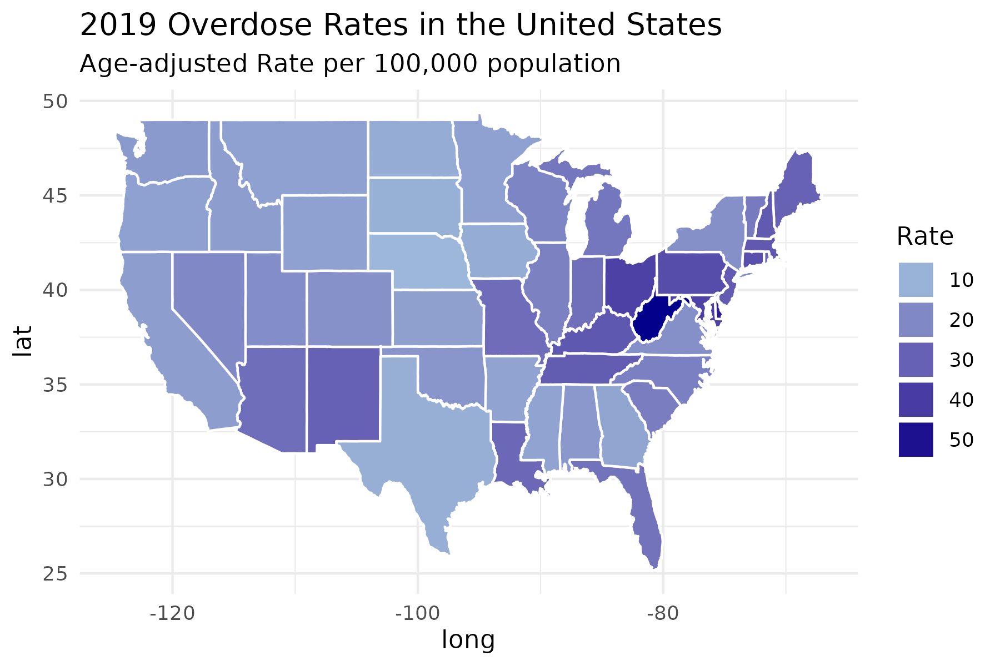
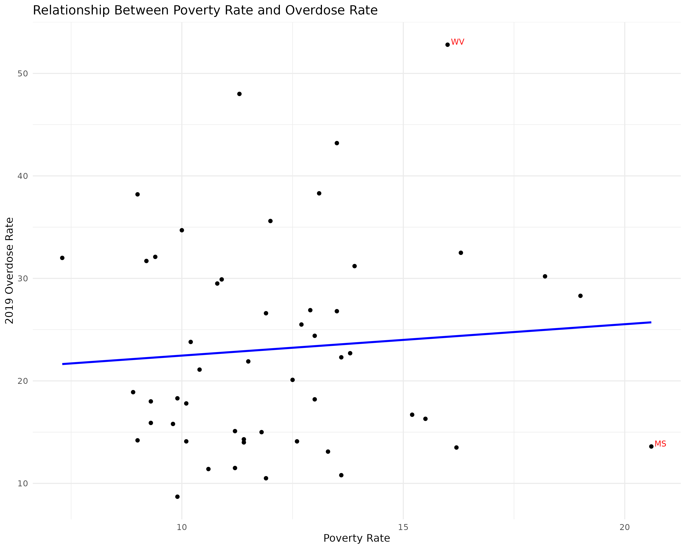
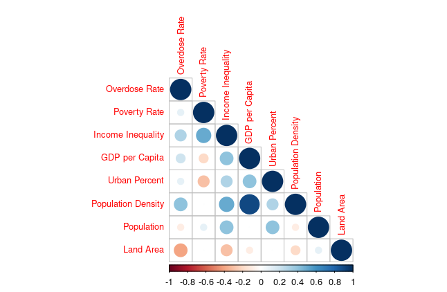
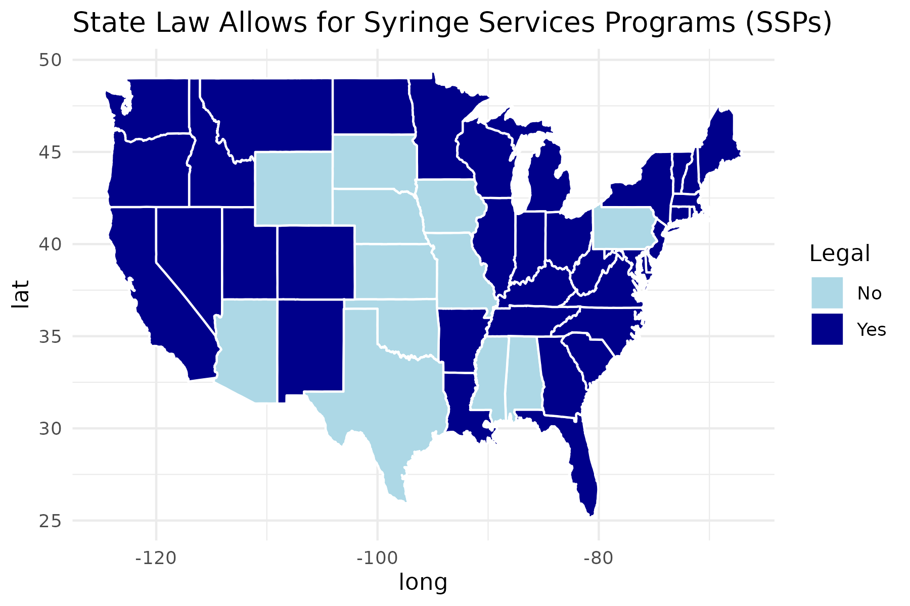
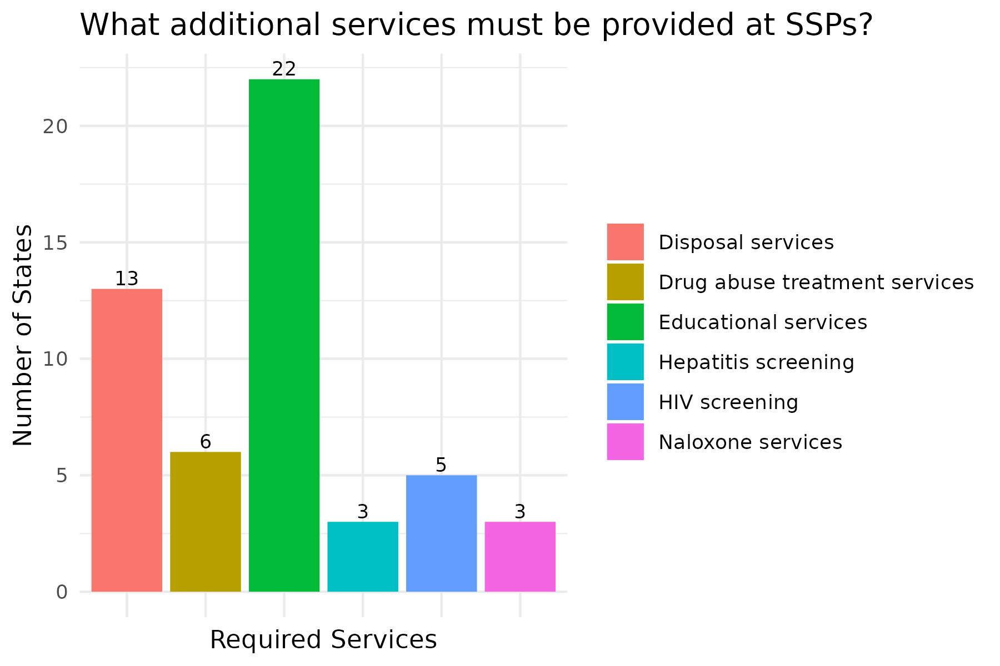
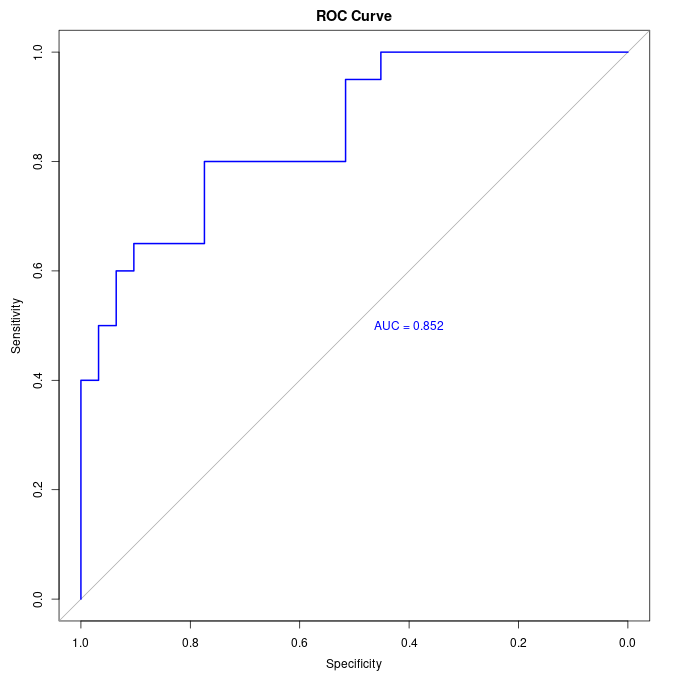

```{r setup, include=FALSE}
knitr::opts_chunk$set(include = FALSE)
```

```{r include=FALSE}
library(tidyverse)
library(readr)
options(kableExtra.auto_format = FALSE)
library(kableExtra)

overdose <- read_csv("source_data/CDC_Drug_Overdose_Deaths.csv", locale = locale(encoding = "latin1"))

ssp <- read_csv("source_data/SSP_Data.csv", locale = locale(encoding = "latin1"))
```


# Introduction
In this project I aimed to understand if how a variety of economic and political factors impact drug overdose rates in the United States. Drug overdose deaths are a leading cause of injury-related death in the United States. The majority of these drug overdose deaths involve opioids, mainly fentanyl, but stimulants, such as cocaine and methamphetamine, also are a major contributor to overdoses. Harm reduction is a major part of the National Overdose Prevention Strategy put forth by the Department of Health and Human Services. Harm reduction involves a variety of destigmatizing strategies such as access to naloxone to reverse an overdose and substance test kits (including fentanyl test strips), syringe exchange programs, HIV/ infectious disease testing, and more. However, some hold the view that these harm reduction strategiesas enable or encourage drug use, and, thus, they are not legal in all states. 

To explore these connections, I used two datasets. The first dataset was extracted from the CDC and had information on state opioid overdose rates per 100,000 and total number of opioid related deaths between the years 2013 to 2019. This CDC dataset also contained economic information, such as the poverty rate, the Gini coefficient of income inequality, and GDP per capita, and general population information, such as urban population percentage and population density. This first dataset is available [here](https://www.kaggle.com/datasets/craigchilvers/opioids-in-the-us-cdc-drug-overdose-deaths/data).

The second dataset has information harm reduction laws in each state, specifically focusing on the legality of syringe service programs. According to the CDC, syringe services programs (SSPs) are community-based prevention programs that offer safe access to and disposal of sterile syringes and injection equipment. These programs also offer vaccinations, testing, and linkage to care and treatment for infectious diseases and substance use disorders. This second dataset is available [here](https://lawatlas.org/datasets/syringe-services-programs-laws).

#  Exploratory Data Analysis

I looked at how drug overdose rates have changed overtime by examining the overdose rates across the United States in 2013 and in 2019. In examining these two maps, it seems as though most states' overdose rates worsened. However, a limited number of states in the mid-west improved: Montana, Nevada, Oklahoma, Utah, and Wyoming.
 

 

It would also be interesting to see how poverty rate relates to overdose rate. Upon further examination it seems that that there is potentially slight, positive relationship between 2019 poverty rates and overdose rates. Indicating that there could be positive correlation between higher poverty rate and higher overdose rate. There are two extreme values that are highlighted in the graph, West Virginia has a particularly high overdose rate and Mississippi has a high poverty rate. 


This also made me think about what other relationships existed within the overdose dataset. Based on the correlation matrix we can see that 2019 overdose rate is most strongly correlated with income inequality, population density, and land size. 
 
I also wanted to investigate the second data set, which contained information on syringe services programs (SSPs). First, I looked for which states have state laws that allow for the operation of syringe service programs. SSPs are legally allowed to operate in 38 states. The 12 states were SSPs are illegal are mostly found in the mid-west and south, with Pennsylvania being the only state outside those regions. 

 
Many states also have additional services that are required to be provided at SSPs, including HIV screening, Educational services, Disposal services, Drug abuse treatment services, Hepatitis screening, and Naloxone services. Educational services are the most common requirement among states. 



# Classification

Now that we have some understanding of what our data sets look like, we can explore which of these variables impact overdose rates. This is a rather small data set, as it only contains information about the 50 states and Washington DC, therefore, there are limitations to this analysis. 

Despite these limitations, I conducted K-Fold Cross Validation on this data set. This is done to simulate having more data by repeating our train test split in a very specific way. This technique walks down the data set in steps of K and re-runs the model each time. 

I established a new variable for when the overdose rate per 100,000 was particularly high, higher than 25 deaths. 

```{r echo=FALSE}
coefficients_table <- read_csv("derived_data/coefficients_table.csv", show_col_types = FALSE)

make_outputs <- function(){
  print(kable_styling(kable(coefficients_table, 
                            format = "simple", 
                            col.names = c('Parameters', 'Significance'))))
}

make_outputs()

```


The significant coefficients table the non-zero parameters are 2019 Poverty rate,  2021 GDP per capita, Population density, and the legality of SSPs. 

We can then examine the ROC Curve and AUC of this model to check the performance of this classification model. The ROC curve has a good shape and its AUC is 0.852, which indicates a good classification level. 



# Future Questions
In the future, I would combine this with a larger data set that has information about the overdose deaths in each state. With this larger data set, a more robust and accurate analysis could be conducted to see which variables predict overdose death. These predictions could point us towards economic and political solutions to slow this crisis. 
